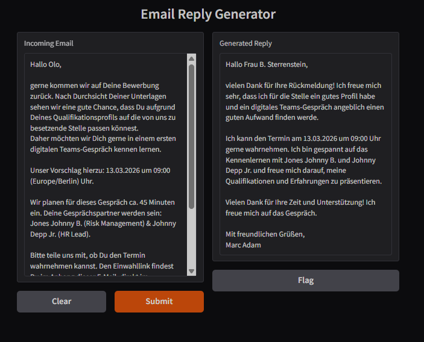

# Result




# Prerequisites

Install Docker Desktop with WSL2 backend on Windows.

---


# Steps


## Get emails

First, let's push your emails in the csv file from your imap email server.

Open extract_past_mails_from_imap.py, adjust parameters and run script. Examples:
```bash
IMAP_SERVER = "server.net"
IMAP_PORT = 993
USERNAME = "mymail@mail.com"
PASSWORD = "abc"
KEYWORDS = ["application", "invitation", "Application", "Invitation"]
```

Afterwards, run the script format_past_mails.py.

☑️ The past_emails.csv file is now prepared and lies in the /gradio_app/ folder.

(If this scripts doesn't work for u: Alternatively, you can manually scrape emails and put them in the column "body_formatted" of the past_emails.csv.)


---


## Build application 


Now, let's build the application: 


Make sure you have Docker installed, then open CMD and navigate to the root folder. Example:
```bash
cd "E:0_git_reposapplication_email_style_based_ai_answerer"
```


Adjust the parameters in the app.py if you want. I chose:
```bash
       #"model": "mistral",  # Original choice, but too heavy on CPU for local usage
       "model": "llama3.2:3b",  # Smaller, GPU-friendly alternative
       "prompt": prompt,
       "max_tokens": 250,       # Maximum number of tokens in the generated reply
       "temperature": 0.7,      # Controls creativity/randomness of the output (0 = deterministic)
       "stream": False          # Whether to stream partial outputs (False = wait for full reply)
```


In the app.py, you can also adjust the prompt:
```bash
   prompt = f"""
You are my personal email assistant ...
...
"""
```


Before we can start the app, we need to load the AI Model (llama3.2:3b, around 2GB big and enough for this use case):
```bash
docker-compose up -d ollama
docker exec -it ollama /bin/bash
ollama pull llama3.2:3b
```
-> this is a 2GB download that loads the ai model into the container (ephemeral!).
```bash
ollama list 
```
-> should show up.


Afterwards, run the code:
```bash
docker-compose up --build -d gradio_app
```
(don't run docker-compose up --build -d without the gradio_app, otherwise you'll recreate the ollama container and lose the pulled ai model in the container)


☑️ Frontend app now started, open in your browser on http://localhost:7860/.


Start generating 🚀.


---


# PS

* Sadly, I didn't manage to run the model on the GPU, therefore the CPU is under heavy bombardement for this task and might shoot up to 80%. But it works in around 40 seconds still and not too bad.
* The "Flag" button has no effect.